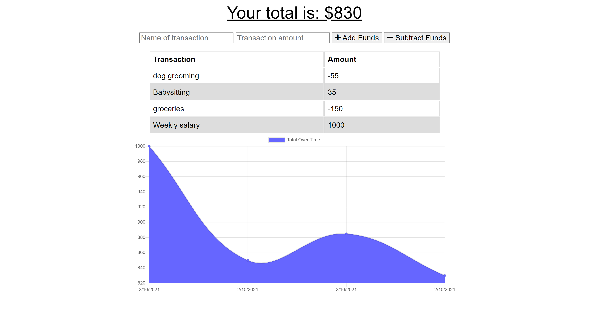

# Budget Tracker

## Description
Budget Tracker is a simple Progressive Web App designed to keep track of income and expenses.  It can be downloaded directly onto a mobile device and will also work offline.  The app uses MongoDB, IndexedDB, and service workers to allow the budget to be accessed both online and offline. 


## Table of Contents
- [Description](#Description)
- [Installation](#Installation)
- [Usage](#Usage)
- [License](#License)
- [Contributing](#Contributing)
- [Badges](#Badges)
- [Questions](#Questions)
- [Credits](#Credits)

---

## Installation
From your computer web browser, go to the [Heroku site](https://vast-bayou-13467.herokuapp.com/) for this app.  Click on the download button to the right of the address bar, and the app will install on the computer home screen. 

From a mobile device browser, go to the [Heroku site](https://vast-bayou-13467.herokuapp.com/) for this app.  Click on the share button at the bottom of the screen and choose Add to Home Screen.  The app can now be accessed through the icon.

---

## Usage
Enter the name of the transaction and the amount, then choose to add or subtract funds.  The entry will show in the list below and will be charted on the graph.



---

## License
This application is covered under MIT License

<details>
  <summary>
    License Text
  </summary> 

```

Copyright (c) 2021  Jacquie Gutierrez

Permission is hereby granted, free of charge, to any person obtaining a copy
of this software and associated documentation files (the "Software"), to deal
in the Software without restriction, including without limitation the rights
to use, copy, modify, merge, publish, distribute, sublicense, and/or sell
copies of the Software, and to permit persons to whom the Software is
furnished to do so, subject to the following conditions:
      
The above copyright notice and this permission notice shall be included in all
copies or substantial portions of the Software.
      
THE SOFTWARE IS PROVIDED "AS IS", WITHOUT WARRANTY OF ANY KIND, EXPRESS OR
IMPLIED, INCLUDING BUT NOT LIMITED TO THE WARRANTIES OF MERCHANTABILITY,
FITNESS FOR A PARTICULAR PURPOSE AND NONINFRINGEMENT. IN NO EVENT SHALL THE
AUTHORS OR COPYRIGHT HOLDERS BE LIABLE FOR ANY CLAIM, DAMAGES OR OTHER
LIABILITY, WHETHER IN AN ACTION OF CONTRACT, TORT OR OTHERWISE, ARISING FROM,
OUT OF OR IN CONNECTION WITH THE SOFTWARE OR THE USE OR OTHER DEALINGS IN THE
SOFTWARE.

```
</details>

---

## Contributing
Please contact the author of this application to request access to the repository as a contributor/

[Jacquie Gutierrez](https://github.com/Jacquie24)

---

## Badges
[](https://opensource.org/licenses/MIT)

---

## Questions
Please comment on the repository for this project [budget tracker](https://github.com/Jacquie24/fitness-tracker), and I will get back to you.

---

## References
* [Mongoose](https://www.npmjs.com/package/mongoose)
* [MongoDB Atlas](https://www.mongodb.com/cloud/atlas)